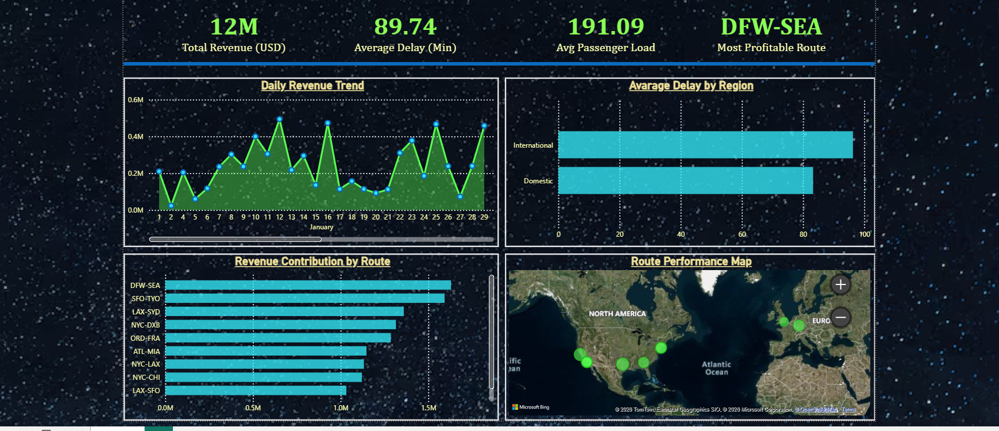

# ✈️ Airline Performance Dashboard (Power BI)

## 📊 Project Overview
This project presents an interactive Power BI dashboard designed to analyze airline performance metrics such as revenue, delays, passenger load, and route profitability.
## 🔍 Key Insights
- Total Revenue: 12M USD
- Average Delay: 89.74 minutes
-
 Most Profitable Route: DFW-SEA

## 📌 Features
- KPI Cards (Revenue, Delay, Passenger Load, Profitability)
- Daily Revenue Trend Analysis
- Delay Comparison (Domestic vs International)
- Revenue Contribution by Route
- Map Visualization (Route Performance)

## 🛠 Tools Used
- Power BI
- DAX
- Data Visualization

## 📷 Dashboard Preview

## 🚀 Outcome
This dashboard helps stakeholders quickly understand performance trends and make data-driven decisions.
